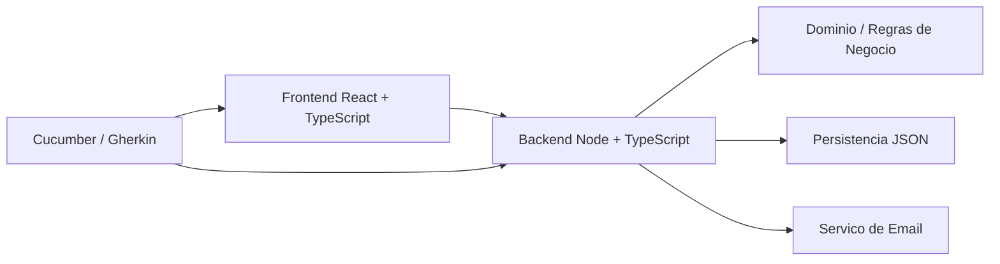

# Arquitetura do Projeto

## 1. Visao geral

O sistema sera uma aplicacao web fullstack com:

- Frontend em React + TypeScript
- Backend em Node.js + TypeScript
- Persistencia em arquivos JSON
- Testes de aceitacao com Cucumber/Gherkin
- Envio de email consolidado por aluno, com agrupamento diario das alteracoes de avaliacao

O dominio central e formado por alunos, turmas, matriculas e avaliacoes por meta.

## 2. Objetivo arquitetural

A arquitetura deve priorizar:

- Separacao clara entre interface, dominio e infraestrutura
- Regras de negocio concentradas no backend
- Persistencia simples e transparente via JSON
- Modelo preparado para evolucao futura para banco relacional sem reescrita do dominio
- Testabilidade com cenarios de aceitacao em linguagem natural

## 3. Principios de design

- Modelo orientado ao dominio, com entidades e regras explicitamente separadas
- API como contrato unico entre frontend e backend
- Estado persistido apenas no backend
- Interface React apenas consome e apresenta dados
- Email tratado como infraestrutura, nao como regra de negocio principal
- Operacoes de leitura e escrita devem ser idempotentes sempre que possivel

## 4. Visao de alto nivel



## 5. Camadas do sistema

### 5.1 Frontend

Responsabilidades:

- Listar, criar, editar e remover alunos
- Listar, criar, editar e remover turmas
- Exibir a matriz de avaliacoes por turma
- Permitir alteracao de conceitos por meta
- Exibir feedback de validacao e persistencia

Regras:

- Nao implementar regra de negocio critica no cliente
- Validar apenas o suficiente para experiencia de usuario
- Sempre confirmar alteracoes atraves da API

Tecnologias sugeridas:

- React
- TypeScript
- React Router
- Biblioteca de formulários opcional, se necessario
- Biblioteca de componentes opcional, se a equipe quiser acelerar a UI

### 5.2 Backend

Responsabilidades:

- Expor API REST para alunos, turmas, matriculas e avaliacoes
- Validar regras de negocio
- Persistir dados em JSON
- Consolidar eventos de avaliacao para email diario
- Servir como fonte unica da verdade do sistema

Tecnologias sugeridas:

- Node.js
- TypeScript
- Express ou Fastify
- Biblioteca de validacao opcional, como Zod ou Joi
- Biblioteca de email, como Nodemailer, ou adaptador equivalente

### 5.3 Dominio

O dominio deve ser independente da camada HTTP e da persistencia.

Conter:

- Entidades
- Value objects
- Regras de validacao
- Servicos de dominio
- Casos de uso

### 5.4 Infraestrutura

Conter:

- Leitura e escrita dos arquivos JSON
- Adaptador de envio de email
- Agendador do processamento diario de emails
- Logs e tratamento de erro tecnico

## 6. Modelo de dominio

### 6.1 Entidades principais

#### Aluno

- id
- nome
- cpf
- email

Regras esperadas:

- CPF unico
- Email valido
- Nome obrigatorio

#### Turma

- id
- descricaoTopico
- ano
- semestre

Regras esperadas:

- Ano obrigatorio
- Semestre obrigatorio
- Descricao obrigatoria

#### Meta

- id
- nome
- ordem

Sugestao de metas:

- Requisitos
- Testes
- Outros criterios definidos pelo negocio

#### Matricula

- id
- alunoId
- turmaId

Representa a relacao entre aluno e turma.

#### Avaliacao

- id
- alunoId
- turmaId
- metaId
- conceito
- atualizadoEm

Conceitos validos:

- MANA
- MPA
- MA

### 6.2 Agregacoes

A modelagem recomendada e:

- Aluno como agregado simples
- Turma como agregado que referencia matriculas e avaliacoes
- Avaliacao pertencente ao contexto da turma e do aluno

Na pratica, a avaliacao nao deve ser tratada como dado isolado do aluno globalmente, e sim como dado contextual da turma.

## 7. Regras de negocio

- Criar, alterar e remover alunos
- Criar, alterar e remover turmas
- Matricular e desmatricular alunos em turmas
- Registrar e alterar avaliacoes por meta
- Exibir tabela de avaliacoes por turma, com alunos nas linhas e metas nas colunas
- Persistir alunos, turmas, matriculas e avaliacoes em JSON
- Enviar email ao aluno quando uma avaliacao for criada ou alterada
- Consolidar em um unico email diario todas as alteracoes de um mesmo aluno, mesmo que ocorram em varias turmas

## 8. Estrategia de email

O requisito de email tem duas partes:

- Disparo por alteracao de avaliacao
- Consolidacao diaria para evitar excesso de mensagens

Arquitetura sugerida:

- Cada alteracao gera um evento de dominio, por exemplo: AvaliacaoAlterada
- O evento alimenta uma fila/registro de emails pendentes por aluno e por data
- Um job diario processa os pendentes e envia um email consolidado

Estrutura do email:

- Dados do aluno
- Data de consolidacao
- Lista de turmas afetadas
- Lista de metas alteradas
- Conceito anterior e novo conceito, se necessario para contextualizacao

Pontos importantes:

- O sistema precisa definir timezone oficial
- O agrupamento deve ser feito por aluno + dia
- Uma mesma meta alterada varias vezes no mesmo dia deve aparecer de forma consolidada, preferencialmente com o estado final

## 9. Persistencia em JSON

Como o requisito pede JSON, a persistencia pode ser separada por contexto:

- alunos.json
- turmas.json
- matriculas.json
- avaliacoes.json
- metas.json
- emails_pendentes.json

Alternativa:

- Um unico arquivo grande com todas as estruturas embutidas

Recomendacao:

- Usar arquivos separados por responsabilidade para facilitar manutencao e testes

Cuidados:

- Escrita atomica para evitar corrupcao
- Backup temporario ao gravar
- Bloqueio ou serializacao de acessos concorrentes

## 10. API sugerida

### 10.1 Alunos

- GET /alunos
- POST /alunos
- PUT /alunos/:id
- DELETE /alunos/:id

### 10.2 Turmas

- GET /turmas
- POST /turmas
- PUT /turmas/:id
- DELETE /turmas/:id

### 10.3 Matriculas

- POST /turmas/:turmaId/matriculas
- DELETE /turmas/:turmaId/matriculas/:alunoId
- GET /turmas/:turmaId

### 10.4 Avaliacoes

- GET /turmas/:turmaId/avaliacoes
- PUT /turmas/:turmaId/alunos/:alunoId/meta/:metaId

### 10.5 Email e processamento interno

- Acoes internas de backend, sem necessidade de exposicao publica na primeira versao

## 11. Estrutura de frontend sugerida

```text
src/
  app/
  components/
  pages/
    alunos/
    turmas/
    avaliacoes/
  services/
  hooks/
  types/
  utils/
```

### Paginas principais

- Lista de alunos
- Formulario de aluno
- Lista de turmas
- Formulario de turma
- Tela de avaliacao de turma
- Tela de detalhes da turma

### Componentes principais

- Tabela de alunos
- Formulario de aluno
- Tabela de turmas
- Formulario de turma
- Matriz de avaliacoes
- Seletor de conceito

## 12. Estrutura de backend sugerida

```text
src/
  modules/
    alunos/
    turmas/
    matriculas/
    avaliacoes/
    emails/
    metas/
  domain/
  infrastructure/
    persistence/
    mail/
    scheduler/
  shared/
  tests/
```

### Separacao por modulo

Cada modulo pode conter:

- controller
- service/use case
- repository
- schemas/validators
- tests

## 13. Fluxos principais

### 13.1 Cadastro de aluno

1. Usuario preenche nome, CPF e email
2. Frontend envia para a API
3. Backend valida os dados
4. Backend persiste o aluno em JSON
5. Frontend atualiza a lista

### 13.2 Cadastro de turma

1. Usuario informa descricao, ano e semestre
2. Backend valida e salva a turma
3. Alunos sao vinculados via matricula
4. A turma fica disponivel para exibicao e avaliacao

### 13.3 Lancamento de avaliacao

1. Usuario altera o conceito de um aluno em uma meta
2. Backend salva a avaliacao
3. Backend registra o evento de notificacao
4. Job diario consolida os itens e envia email

## 14. Testes de aceitacao com Cucumber

Os testes de aceitacao devem validar o sistema em linguagem de negocio.

Cenarios essenciais:

- Criar aluno valido
- Impedir aluno com CPF duplicado
- Criar turma
- Matricular aluno em turma
- Registrar avaliacao por meta
- Exibir tabela de avaliacoes por turma
- Consolidar emails do mesmo aluno no mesmo dia

Sugestao de organizacao:

- features/alunos.feature
- features/turmas.feature
- features/avaliacoes.feature
- features/emails.feature

## 15. Niveis de validacao

### Frontend

- Campos obrigatorios
- Formato basico de email
- Interacao rapida com o usuario

### Backend

- Regras de dominio
- Unicidade de CPF
- Valores validos de conceito
- Consistencia entre turma, matricula e avaliacao

### Persistencia

- Integridade do JSON
- Serializacao consistente
- Leitura resiliente

## 16. Riscos tecnicos

- Persistencia JSON pode ficar fragil sob concorrencia
- Consolidacao diaria de emails exige controle de data e timezone
- O modelo de metas pode precisar de definicao mais clara se for fixo ou por turma
- Exclusao de alunos e turmas precisa de politica explicita de dependencia

## 17. Decisoes recomendadas antes de codificar

- Definir se metas sao globais ou por turma
- Definir politica de exclusao com dependencias
- Definir timezone oficial do agrupamento diario
- Definir se o email consolidado sera enviado em horario fixo ou via job noturno
- Definir formato final do JSON

## 18. Proxima etapa sugerida

Depois desta arquitetura, o passo natural e detalhar:

1. o modelo de dados completo
2. os casos de uso do backend
3. os cenarios Gherkin iniciais
4. o backlog tecnico de implementacao
